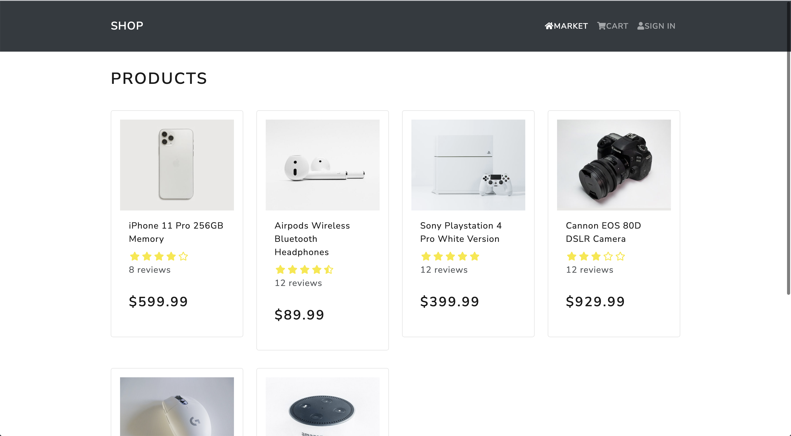
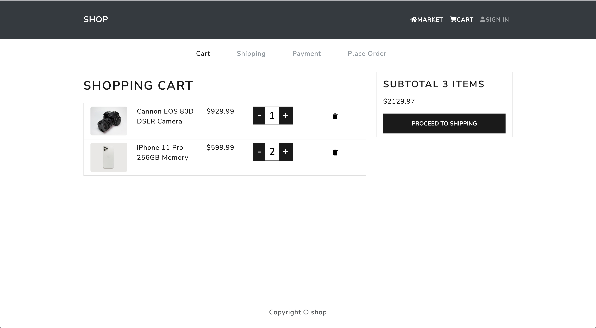

# MERN-ECOMMERCE




1. You need to add these variable in .env file at root

- NODE_ENV = development
- PORT = 5000
- MONGO_URI = mongodb+srv://root:root@\*\*\*
- JWT_SECRET = \*\*\*
- PAYPAL_CLIENT_ID = \*\*\*

2. To start front end and back end

```
npm run dev
```

3. To start front end

```
npm run client
```

4. To start back end

```
npm run server
```
